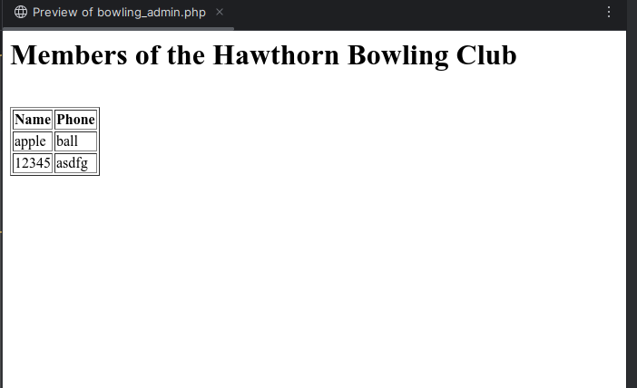

# Lab Activity 3

This file contains my understanding and steps I took on doing lab activity 3.

### Activities
a. [Fourth Element](#a-fourth-element)  
b. [Palindrome](../Lab3/palindrome.php)  
c. [Bowling Registration](../Lab3/Resources/bowling_registration.php), [Bowling admin](../Lab3/Resources/bowling_admin.php)  
d. [Number Search](../Lab3/number_check.php)  
e. [Quiz](../Lab3/quiz.php)


# Exercises

### a. Fourth Element
```php
$fruit = array ("one"=>"grapes", "two"=>"banana",  "three"=>"cherry", "four"=>"apple");
asort ($fruit);
``` 
- What is the final fourth element value in array $fruit?   
**Answer:** The fourth element is `grapes`


- If ksort is used instead of asort, what is the final fourth element value in array $fruit?  
**Answer:** If `ksort` is used instead of asort, the fourth element is `banana`.  

### b. Palindrome
- Write a PHP file that tests whether a word or phrase, entered by a user through a text box in a form is a perfect palindrome.  
  (A palindrome is a word, phrase, number, or other sequence of symbols or elements, whose meaning may be interpreted the same way in either forward or reverse direction.)

   **Answer:** See attached file [palindrome.php](../Lab3/palindrome.php)

### c. Bowling Registration
- Understand the code bowling_registration.php & bowling_admin.php (download Lec3Examples in Lecture 3 onCanvas).
   - **Answer:** Done. There are some issues with the code. Firstly, if the file doesn't exist, the program throws a registration error and does not automatically create the required file. Secondly, there isn't enough validation to check the data type of input values.
     If the file exists, the bowling_registration.php file saves the data to the bowlers.txt file. The saved data can be viewed using bowling_admin.php file. The data is shown in a table.  

     

### d. Search
  - Write a phone number search function using PHP. You should provide an input text box on the page to let users input the name in the bowling club (see Figure 2). After users click the “search” button, the phone number of that name is shown on the page.  
    **Answer:** See attached file [number_check.php](../Lab3/number_check.php)

### e. Quiz
- Change the simple online quiz PHP page that you wrote for exercise (e)in Lab2. Instead of hard coding the questions on the HTML page, you need to store them ina file. You also need to store the answers in a file and this file can be the same as the file for questions, or simply a different file. When the page is loaded, it will read the questions from the file and display them on the screen. So if questions/answers are changed, this program can be used without modifying any of PHP codes.  
   **Answer:** See attached file [quiz.php](../Lab3/quiz.php)

