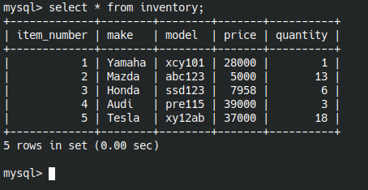
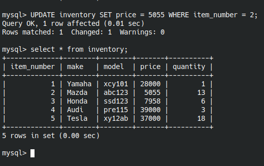

# Lab Activity 4

This repository contains the solutions and documentation and my understanding for Lab Activity 4.

## Activities

1. [MySQL Database Operations](#mysql-database-operations)
2. [MySQL Database Operations via phpMyAdmin](#mysql-database-operations-via-phpmyadmin)
3. [PHP Script to Display Inventory Data](#php-script-to-display-inventory-data)
4. [PHP Script to Insert New Inventory Data](#php-script-to-insert-new-inventory-data)
5. [MySQL Query to Retrieve Employee Data](#mysql-query-to-retrieve-employee-data)
6. [Modified SearchSkill.php Script](#modified-searchskillphp-script)
7. [Database-Powered Online Quiz](#database-powered-online-quiz)

## Exercises

### a. Inventory
- Create a MySQL database table named ‘inventory’ in MySQL Monitor, a command-line program. The structure of inventory table is the shown in the lecture slides for Week 4(slide #24).  
```sql
create database if not exists inventory;
use inventory;
CREATE TABLE inventory ( item_number int NOT NULL AUTO_INCREMENT, make char(20) NOT NULL, model varchar(30) NOT NULL, price double NOT NULL, quantity int NOT NULL, PRIMARY KEY (item_number));
```  
- Insert at least 5 records into the table  
```sql
INSERT INTO inventory(make, model, price, quantity) VALUES ('Yamaha', 'xcy101', 28000, 1);
INSERT INTO inventory(make, model, price, quantity) VALUES ('Mazda', 'abc123', 5000, 13);
INSERT INTO inventory(make, model, price, quantity) VALUES ('Honda', 'ssd123', 7958, 6);
INSERT INTO inventory(make, model, price, quantity) VALUES ('Audi', 'pre115', 39000, 3);
INSERT INTO inventory(make, model, price, quantity) VALUES ('Tesla', 'xy12ab', 37000, 18);
```


- Write a query that return all records of the table  
```sql
select * from inventory;
```
  

- Update an existing table row using ‘update’ statement.  
```sql
UPDATE inventory SET price = 5055 WHERE item_number = 2;
```
  

## b. Employees
- Create a MySQL database table named ‘Employees’ in phpMyAdmin. The structure of Employees table is the shown in the 
lecture slides for Week 4 (slide #3).  Then, similar to a), use this web interface to insert some data into this table 
and write SQL codes to query/update the table.  
```sql
create table employees(last_name varchar(15) not null, first_name varchar(15) not null, address varchar(45) not null, city varchar(30) not null, state varchar(15) not null, zip int(8) not null);
insert into employees (last_name, first_name, address, city, state, zip) values ('Bolver', 'Maire', '02117 Barby Court', 'Sydney', 'NSW', '1130'),
                                                                                ('Revening', 'Aubert', '92978 Pawling Trail', 'Albuquerque', 'NM', '87140'),
                                                                                ('Lumox', 'Trevor', '111 Morrow Hill', 'Sydney', 'NSW', '1196'),
                                                                                ('Gilberthorpe', 'Ulrika', '62166 Morrow Pass', 'Melbourne', 'VIC', '8045'),
                                                                                ('Leither', 'Harriett', '84952 Briar Crest Street', 'Albuquerque', 'NM', '87140'),
                                                                                ('Lindblad', 'Brien', '5 Upham Crossing', 'Sydney', 'NSW', '1196'),
                                                                                ('Darkins', 'Ada', '090 Grayhawk Crossing', 'Adelaide Mail Centre', 'SA', '5889'),
                                                                                ('Baldwin', 'Darleen', '06464 Rowland Point', 'Sydney', 'NSW', '1109'),
                                                                                ('Abercromby', 'Mattias', '7402 Clemons Alley', 'Albuquerque', 'NM', '87140'),
                                                                                ('Balazin', 'Jeannette', '686 Gateway Place', 'Sydney', 'NSW', '1120');
select * from employees;
update employees set city = "newcastle", zip = "123456"  WHERE last_name = "Balazin";
select * from employees;
```
Create and display:  
<br>  
Update record:  


## c. Inventory UI
- Write a PHP page to retrieve records from the ‘inventory’ table created in a), and display them neatly in an html 
table.You need to provide an html select control on the page (see Figure 1). The content of this select control are 
names of all makes that can be found in the inventory table.User can select to show the data of a specific make or show 
the data of all makes(see Figure 2).<br>  
Answer: see attached file [c.php](../Lab4/c.php)<br>  


## d. Employees UI  
- Modify the page in c) to allow user insert new data row from the web page (see Figure 3). After the user input the 
content of new row and press the ‘add’ button, the input data will be inserted into MySQL database. Then the page will
display the updated content of the ‘inventory’ table (see Figure 4).<br>  
Answer: see attached file [employees](../Lab4/d.php)<br>  


## e. Working with data across multiple tables
1. The following three tables are created with some data in a database called person_db.  
``` sql
Employees(employee_id,  last_name,  first_name,  address, city, state, zip);
Experience(employee_id, language_id, years);
Languages(language_id, language);
```
Rather than creating new table for employees, the existing employee table was used. ID column was added as a
primary key and set as auto increment. The following command was used.
```sql
ALTER TABLE employees ADD COLUMN id INT AUTO_INCREMENT PRIMARY KEY FIRST;
```
Then created the required two tables.  
```sql
CREATE TABLE languages (language_id INT AUTO_INCREMENT PRIMARY KEY, language VARCHAR(30));
CREATE TABLE experience (employee_id INT, language_id INT, years INT, FOREIGN KEY (employee_id) REFERENCES employees(id), FOREIGN KEY (language_id) REFERENCES languages(language_id));
```
I have used https://www.mockaroo.com/ to generate 100 random data.
```sql
insert into experience (employee_id, language_id, years) values  (7, 1, 8),(7, 4, 4),(9, 1, 10),(3, 7, 6),(4, 2, 7),
    (10, 9, 8),(6, 7, 8),(6, 9, 5),(10, 2, 5),(4, 9, 6),(8, 9, 7),(5, 6, 10),(1, 7, 6),(2, 2, 7),(8, 8, 8),(6, 1, 1),
    (7, 8, 6),(4, 4, 3),(1, 4, 10),(2, 4, 7),(1, 8, 10),(2, 8, 7),(5, 4, 6),(2, 9, 6),(7, 3, 9),(4, 10, 6),(10, 7, 6),
    (5, 1, 3),(6, 8, 1),(9, 10, 10),(9, 3, 4),(3, 5, 6),(7, 6, 4),(10, 4, 9),(6, 5, 5),(9, 5, 4),(5, 10, 8),(5, 3, 2),
    (8, 6, 8),(8, 7, 7),(8, 3, 3),(2, 6, 4),(5, 2, 3),(4, 6, 6),(3, 3, 10),(3, 4, 9),(1, 6, 7),(10, 3, 5),(1, 10, 7),
    (6, 6, 8),(3, 2, 5),(10, 8, 4),(6, 10, 8),(10, 5, 5),(9, 7, 8),(2, 3, 10),(10, 1, 1),(5, 8, 5),(5, 9, 4),(6, 3, 5),
    (8, 5, 4),(7, 7, 8),(7, 10, 7),(10, 6, 6),(9, 2, 5),(9, 6, 5),(7, 9, 8),(3, 1, 1),(1, 9, 3),(3, 6, 9),(10, 10, 8),
    (4, 7, 4),(1, 2, 9),(9, 4, 9),(8, 10, 7),(5, 7, 10),(8, 2, 3),(7, 2, 7),(9, 8, 6),(1, 5, 10),(9, 9, 5),(2, 7, 4),
    (7, 5, 8),(8, 1, 6),(3, 8, 10),(3, 9, 9),(4, 8, 10),(3, 10, 10),(6, 4, 2),(4, 3, 4),(1, 1, 5),(2, 10, 7),(2, 1, 4),
    (2, 5, 2),(6, 2, 7),(4, 5, 4),(5, 5, 1),(1, 3, 7),(4, 1, 9),(8, 4, 6);
```


- Write  the  SQL  query statement to  retrieve  those  employees  (with  their  items: first_name,  last_name,  language, years,  city)  who  have  5  years’  experience  in “PHP” and  live in the city “Melbourne”.
```sql
SELECT e.first_name, e.last_name, l.language, x.years, e.city FROM employees e, experience x, languages l WHERE e.id=x.employee_id and x.language_id=l.language_id and l.language = 'PHP' AND x.years >= 5 AND e.city = 'Melbourne';
```


## f. SearchSkill

- Modify the code SearchSkill.php introduced in Lecture 4 (download Lec4Examples.zip from Blackboard) to get city, language, and years from the interface and output the search result as below by using the similar  SQL query in e):<br>  
Answer: See attached file [searchSkill.php](../Lab4/searchSkill.php)

## g. Simple Quiz

- Change the simple online quiz PHP page that you wrote for exercise (e) in Lab2 and exercise (c) in Lab3. Instead of hard coding the questions on the HTML page or store them in a file, you need to store them in one or more MySQL database tables. You need to design the table structure to store questions and answers properly. When the page is loaded, it will read the questions from the database and display them on the screen. So if questions/answers are changed, this program can be used without modifying any of PHP codes.
    - Following commands were used to create table and save questions/answers.
    ```sql
    use inventory;
    create table if not exists quiz( question text, options text, correct_answer char(15));
    insert into quiz (question, options, correct_answer) values
        ("What is the orange part of an egg called?", "Jelly, Ball, Yolk, Eggshell", "Yolk"),
        ("What is a baby kangaroo called?", "Kongo, Joey, Boy, Club", "Joey"),
        ("In which country can you find the Eiffel Tower?", "Paris, Italy, USA, France", "Paris"),
        ("What's the name of the river that runs through Egypt?", "The Mile, The Nile, The Amazon, The River of Egypt", "The Nile"),
        ("What's the highest mountain in the world?", "Burj Khalifa, Mount K2, Everest, Mount Snow Peak", "Everest");
    ```
  
  - see attached file [quiz.php](../Lab4/quiz.php)

You can also view my lab progress in [My personal website](https://wadd.probitytech.work). The labs will be up to date with activities I have done.
Google chrome might flag the site as unsafe but the site uses HTTPS and runs fine using firefox.